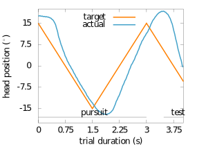
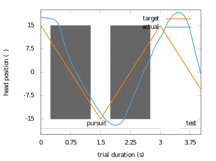
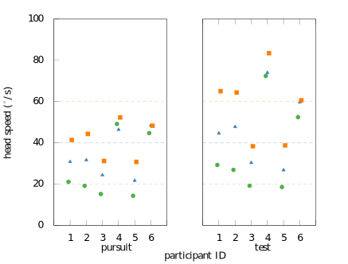
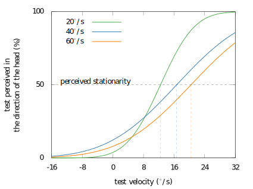
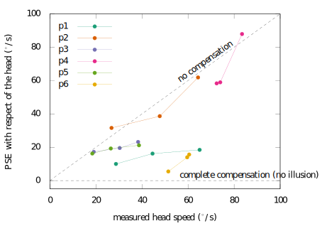

.. _ref-chap-filehne:

The Filehne experiment
======================

Motivations
-----------

Speed perception has been intensively studied in vision. Even if the behaviour
of speed mechanisms is still on debate (:cite:`Freeman2001,Freeman2010`), it
exists low motion mechanisms that can extract the speed information\todo{mention
the difference between speed and velocity. Meaning velocity contains speed and
direction}. In audition, speed seems to be a difficult cue to extract and 
several findings suggested that audition doesn't have low level mechanisms but
can still extract the information :cite:`Grantham1986,Middlebrooks1991`.
We want to understand how speed perception is affected in audition when head
movements occur and compare the results with vision findings. A famous illusion
named after his author :cite:`Filehne1922` showed how speed perception is 
affected in vision when eyes movements occur.

During eye movements, the world around us remains perceptually stable despite of
the retinal image slip (see :numref:`fig-image-motion-views`). The pursuit
adds motion to the image, hence, the brain must add this new estimate to the 
image motion in order to recover the object motion. This process doesn't work
accuratly resulting in misperception of the object velocity during pursuit. This
has been shown through several illusions such as the Aubert-Fleishl phenomenon 
(:cite:`Aubert1886`) where the pursued stimulus appears slower or the Filehne
illusion \parencite{Filehne1922} showing that stationary objects appear to move.
We will discuss the latter below and its impact on audition.

This illusion was named after the research who found it (:cite:`Filehne1922`).
The illusion showed that a stationary object appears to move against the eyes
movement. This process imply two estimates:

.. _fig-image-motion-views:

   Motion perception with or without eye pursuit of a moving object. The first
   image shows the perceived motion during eye fixation. The second shows the
   percieved motion during an eye pursuit.

- the retinal image motion,
- the occulomotor system feedback known as :term:`ERS`.

When we make a smooth eye movement to track a moving object, the visual system
estimates the eyes velocity (using the :term:`ERS`) and then substract it from
the observed retinal motion :numref:`fig-eye-pursuit`.

.. _fig-eye-pursuit:

   Signals used to infer the motion of an object during an eye pursuit.
  

As shown on the retinal image motion and the eye muscles feedback goes in
opposite direction during the smooth pursuit. In order to obtain the object
as stationary, these two estimates as to be equal.

.. math::

  \widehat{H} = \widehat{R} + \widehat{P}
  

.. _fig_visual_filehne_explanation:

   Filehne illusion. Estimation of the speed of an object :math:`widehat{H}`
   through the estimates of the eye pursuit $\widehat{P}$ and the retinal image
   motion :math:`\widehat{R}`.

.. _tab_filehne-equivalences:

+---------------------+--------------------------------------+
| vision              | Audition                             |
+=====================+======================================+
| Eyes rotation       | Head rotation                        |
+---------------------+--------------------------------------+
| Dot                 | Noise                                |
+---------------------+--------------------------------------+
| Grating background  | No background                        |
+---------------------+--------------------------------------+
| No visual reference | No auditory **and** visual reference |
+---------------------+--------------------------------------+

.. todo:: 
  
   Find a way to insert a caption for this table. The caption should be  
    the following:
    Equivalences between visual and auditory Filehne experiement.

.. todo:: 

  Equivalence have no reference in the text at the moment, need to be fixed

Broadcasting and motion of the acoustic signals
-----------------------------------------------

In order to create a smooth motion we decided to have one signal per speaker
and apply a spatial gaussian window letting us to compute the gains to apply
on each channel for a given source position. In order to avoid phase problems
at the listener's head, we used on each channel independent random gaussian
noises. The spatial window is computed with a gaussian function (shown on 
:numref:`eq-gaussian-gains`).

.. todo::
    we can compare eventually results with :term:`VBAP`

.. _eq-gaussian-gains:

.. math::

  G = \sqrt{\exp\left(-2 \times \frac{x - p}{w}\right)^2}

The gain for each channel is given by $x$ the position in degrees of each speaker,
:math:`p` the position of the source and :math:`w` the width (spread or
standard deviation) of the source in degrees. If :math:`w = 0`, the source will
be very ponctual [#fn1]_, if :math:`w > 0`, will be broadcast on several
speakers. The position of the source is discrete with a :math:`0.1^\circ` step.
This is enough to obtain a perceived smooth and homogeneous movement and is much 
lower than the best :term:`MAA` of :math:`1^\circ` in front of the listener 
(:cite:`Mills1958`) and consequently of the :term:`MAMA` that is around 
:math:`1^\circ` or larger (:cite:`Saberi1990,Chandler1992,Strybel1992`). One
limitation of this technique is related to the physical distance between the
speakers and corresponds to the parameter :math:`w` of the equation
:numref:`eq-gaussian-gains`. The parameter :math:`w` can't be lower than the
minimum distance between two loudspeakers. In this particular case, the motion
will not be smooth anymore but will jump from one speaker to another. Another
limitation is the computer's processor. Because the experiment has a real time
constraint (due to the acquisition of head position data), the filtering
process can disrupt the real processing.

.. _fig-sound-spat:

   Spatialisation of the stimuli using an array of loudspeakers. Intensity of
   each speaker is respect to the gain of a gaussian function. These gains
   change over time.

Head motion, the pursuit
------------------------

A key point of the experiment is to control the participant head movement in 
order to keep his head speed as constant as possible. In vision, we know that
eye movements are saccadic they can move smoothly when pursuit. First we tested 
on ourselves our capaticy to move our head at constant speed. It appeared that
it was a very difficult task. It has been decided to lead a small and informal
experiment in order to find the best method to obtain smooth head movements.
We measured 6 participants using a metronome. The metronome used a click stimulus
\todo{Nature and description of the conditions}. Participants were asked to
anticipate the stimulus by pointing their nose at the click locations. A trial
corresponded to two back and forth of the head 
The results showed mainly saccadic behaviors not related to the speed condition
and not constant over time.

.. todo::
  number of trial per session.

We decided then to use a pursuit noise that participants have to follow by
pointing their nose at it. In order to help them to differenciate the test
itself from the pursuit, a low-pass filter were applied on the pursuit.

Auditory Filehne experiment
---------------------------

Paradigm
^^^^^^^^

The aim of the experiment was to examined the auditory motion perception during
head movements. The general task took the form of a :term:`2AFC` in which the 
subject was required to indicate which direction the stimulus appeared to move.
Each trial was decomposed in two parts: 

- the pursuit,
- the test. 

Each subject participated to 4 sessions containing each three blocks. Before 
the first session [#fn2]_, a training was carried out to familiarise
participants with the task. Each session corresponded to three head speed
conditions: :math:`20`, :math:`40` and :math:`60~^\circ/s`.
One block contained 140 trials and lasted about 30 minutes. Hence, one
participant performed 1680 trials over 6 hours of experiment. Participant
were free to choose how many blocks they want to do each time. If they chose
to do at least two blocks, a rest of 5~mins were given between each block.

.. todo::

  Why we decided to use this type of pursuit and another one ? Because the
  equivalent of a moving dot is a moving sound but with the problem of a non
  finite width, we choose to use a low pass filter to limit the interferences
  with the test and the we were obliged to stop the pursuit in order to not
  interfere with the test. In vision, usually use judge the background and not the
  the dot.

The pursuit in each condition lasted :math:`3~s`. The information about the
pursuit are shown on :numref:`tab-pursuit-info` and
:numref:`fig-filehne-xp-spat`. In order to balance the experiment, the
pursuit direction was alternated on each trial.

The participant had to follow the pursuit by pointing is nose at it. This lasted
two sweeps (back and forth), then the subject had to make a third sweep by
himself.  During this time, the test was presented and the participant had to
judge his direction. The test was presented in order that both the test and
the participants head should cross the :math:`0^\circ` at the same time
(:numref:`fig-xp-explanation`).

.. _fig_xp_explanation:

  Process of the experiment over time and angular position of the head.  The
  black plain line represents the head movement when the pursuit stimulus is
  on. The Black dashed line, the head movement when the pursuit is off.  The
  blue thick line represents the test presentation.

.. _tab-pursuit_info:

+------------------------------+----------------------+-------------------------------------+-------------------------------------+
| Condition (:math:`^\circ/s`) | Duration (:math:`s`) | Displacement range (:math:`^\circ`) | Total displacement (:math:`^\circ`) |
+==============================+======================+=====================================+=====================================+
| :math:`20`                   | :math:`3`            | :math:`\pm15`                       | :math:`60`                          |
+------------------------------+----------------------+-------------------------------------+-------------------------------------+
| :math:`40`                   | :math:`3`            | :math:`\pm30$`                      | :math:`120`                         |
+------------------------------+----------------------+-------------------------------------+-------------------------------------+
| :math:`60`                   | :math:`3`            | :math:`\pm60`                       | :math:`180`                         |
+------------------------------+----------------------+-------------------------------------+-------------------------------------+

.. todo::
  caption to put with the table
  Head pursuit information regarding each condition such as
  total duration, displacement range (one head sweep) and total
  displacement.

The test was randomised on each trial using a range of duration from
:math:`400` to :math:`600~ms`. A range of 5 speeds with a step of
:math:`8^\circ/s`. The basic range was from :math:`-24` to
:math:`24~^\circ/s`. After a preliminary analysis of the training, it
was decided to shift the range of speeds in order to get a :term:`PSE`. In
order to prevent participants to make judgements according to the start and
end of the stimulus (:cite:`Carlile2002`), the test has been roved and its
center varied between :math:`\pm7.5~^\circ` (as shown on
:numref:`fig-filehne-xp-spat`).

.. _fig-filehne_xp_spat:

   Description of the experiment in terms of source and head displacement.
   The head movement according to the conditions will have maximum
   displacement of :math:`90^\circ` centred on :math:`0^\circ`
   (@:math:`60^\circ/s`). The source will displacement is changing randomly
   from trial to trial and it's centre is always between :math:`\pm~7.5^\circ`

.. todo::

   - Talk about the intensity experiment that did not work until now
   - change the different inkscape figure by their tikz equivalent
   - save in a different folder, all script generating tikz plot from octave 
     in a specific folder

Analysis
--------

On the six subjects, everyone completed the task required. Nevertheless, the
analysis revealed that two of these participants had a strange behaviour and
showed the biggest effect regarding the other participants.  Outliers were
defined as no head motion during the test stimulus presentation and as data
acquisition problem. Per session, on average, there is about :math:`0.13\%` of
outliers with a maximum of $3$ outliers on a session and a minimum of :math:`0`.
This low percentage of trial rejection is explained by the observation of
head movements on average and decided to keep almost all trials to lead an
analysis based on true head movements. Results have been computer on each
session and then averaged to get PSEs.

Head movements
^^^^^^^^^^^^^^

Head movements were driven by an audio pursuit target, but like eye movements
to a lesser extent, they tends to be saccadic even when pursuit. To reduce
this effect, a Savitzky-Golay filter (:cite:`Savitzky1964`) was applied on
each trial. This process is achieved by using a local least-squares
polynomial approximation (approximation of the second order in our case)
resulting to a low pass filter on the data set [#fn3]_. 

:numref:`fig-head-behaviour` shows a typical head movement on a trial. The ideal
head movement describes a triangle signal in order to keep a constant speed
over time and angular displacement.  Nevertheless, participants showed
difficulties to reproduce correctly this pattern. This is explained by several
reasons. Firstly, a typical participant pattern is a sinusoidal signal. The
change of head direction can't be immediate due to the weight and inertia of
the head. This effect add a delay to the pursuit.  The other problem is poor
width definition of an audio source. This prevents a good pursuit of the
source. Because participant were in the dark with no visual cue, they can't use
speakers or other references to stop or anticipate direction changes. This
explains why the angular displacement of participant's head can be lower or
greater than the ideal pattern and add another delay. Nevertheless, as shown by
the figure :numref:`fig-head-behaviour`, during the phase between head
direction changes, the participant is able to keep his head movement quite
steady.

.. todo::

  it could be interesting to compute the percentage around the speed target

.. _fig-head-behaviour:

   Head tracking during a trial at condition :math:`20~^\circ/s`. orange plain line
   represents the ideal head movement over time and angular displacement.  The
   blue plain line represents the head movement of participant 1 during the
   trial 4 of session 1.

In order to extract only smooth pursuit movement during both sweeps of the
pursuit task. It has been decided to keep only 1 second of signal when the
head is centered on :math:`0^\circ` (see :numref:`fig-head-analysis`). Then,
for each condition and participant, the mean speed has been computed on each 
trial and then averaged across all sessions for the pursuit and test. The 
results are shown on :numref:`fig-head-speeds-avr`.

.. _fig-head-analysis:

   Head pursuit speed computation. The grey zones represent the meaningful
   parts of head movements used to compute the head speed during pursuit.

The difficulty of participant to follow the pursuit is confirmed by the left
hand side figure that shows the average for each participant and condition
during the pursuit presentation. At :math:`20^\circ/s` participant are
relatively close to the target wheras for :math:`40` and :math:`60^\circ/s` the
general behaviour is to slow down the head speed regarding the target.
Nevertheless, participants 4 and 6 tends to keeps their head around the same
speed whatever the target is and both are around :math:`50^\circ/s`. Even if
they understood the task, these participant seems to have difficulties to
extract the speed information of a moving source and can't use or make the
difference between several sets of interaul cues. If a subject follow perfectly
a sound source, the pair of :term:`ITD` and :term:`ILD` will not evolve over
time [#fn4]_. Based on these cues, a subject should be able to tell if he is
late or ahead regarding the sound source. These cues are the only cues
available during this task and participant 4 and 6 seems to not be able to use
in a accurate way these cues.

.. todo::
  
  These pursuit information are not accurate enough because of the extraction
  method used. I need to correct that in order two possible ways: either try to
  find the 0 deg and extract 1 second of signal around it or transform the
  signal in order to keep all the meaningful information.
    
On the right hand side figure is shown average speed for each participant and
condition. The global behaviour is that all participant accelerate their head
movements. This suggests that, even with a reference before each trial, subject
can't keep the same head speed. The change can be up to :math:`25^\circ/s`,
that is a radical change between two head sweeps. 

.. _fig-head-speeds-avr:

   Head speed distribution according to participants and speed conditions.  The
   left figure represents mean head speeds during the pursuit and right one
   represents the mean head speeds during the test presentation. For the
   pursuit, only sweeps without head direction changes was kept.

perceived speed
^^^^^^^^^^^^^^^

What is the impact of the head movement on the perceived speed of the test. As
a reminder, participant were asked to judge the direction of the test presented
while they were moving their head. The only criteria modified during the task
was the speed of the test. And this task was led for 3 head speeds conditions.
To analyse the data, for each session, participant and condition, the
percentage of test perceived in the direction of the head was computed. Then a
psychometric function was extracted using a Probit analysis
(:cite:`Finney1971`. The meaningful information is the :term:`PSE` at
:math:`50\%` representing the perceived stationnarity of the test. The figure
:numref:`fig-psychometric_function_p1` shows the results of participant 1 for
his first session on each condition. We can abserved firstly that all three
:term:`PSE` are above the :math:`0^\circ/s`. If someone makes a head movement
in front of a fixed sound source, if no effect, were perceived, the perceived
speed of the sound source should be :math:`0^\circ/s`. In the present case,
there is a compensation from the participant and the compensation is in the
opposite direction to the head. This corresponds to a Filehne illusion as
described by :cite:`Filehne1922`. This suggests that participant 1 makes an
estimation error that would maybe be on the proprioceptive information
(:math:`\widehat{H}`) or in the cochlear image motion information
(:math:`\widehat{I}`) as suggested in vision by :math:`Freeman1998`. Secondly,
the figure suggests that the Filehne illusion increased with the 
head speed according to each condition.

.. todo::

  Comment: Nevertheless, as shown on :numref:`fig-head-speeds-avr`, participant
  does not necessary match the theoric head speed conditions espacially during
  the test presentation. In order to confirm the effect, the
  :numref:`fig-individual-differences` shows the :term:`PSE` of each
  participant for each condition. But instead of plotting the theoric head
  speeds, it's the actual head speeds that are shown. All participant, whatever
  the their head speed is suffer the illusion in the same direction (opposite
  to the head movement). Moreover, the illusion increases as the head speed
  increases for all participant. An interesting observation would be that the
  illusion tends to evolve linearly with respect to the head speed. This is
  difficult to verify as the number of participant is really low. Indeed
  participant 2 and especially participant 4 doesn't show a linear illusion but
  it could explained by the fact that their behaviour were a bit strange
  compare to the other\todo{really badly explained, need to be rewritten with a
  better explaination (maybe show their psychometric functions for left and
  right).
  As shown on :numref:`fig-psychometric_function_p1`, the psychometric function
  means that if the participant makes a head movement across a static auditory
  object, this object would appear to move in the opposite direction of the
  head movement.

.. _fig-psychometric_function_p1:

   Psychometric function of the participant 1 for one session. The psychometric
   function shows the PSE of the test velocity according the test stimulus
   perceived in the direction of the head. At the :math:`50~\%`, the stimulus
   appeared to be stationnary. each color represents one condition (:math:`20`,
   :math:`40` and :math:`60~^\circ/s`).

.. _fig-individual-differences:

   Individual differences of PSEs according to the actual speeds on each
   condition for each participant.

.. [#fn1] By ponctual, the source will be broadcast by the closest speaker and
    all over will be set at $0$ dB.

.. [#fn2] The participant, if necessary could ask for a training for following
    sessions because sessions occurs overs two weeks.

.. [#fn3] For a better understanding of this type of filter, the reader can
    refer to :cite:`Schafer2011`.

.. [#fn4] Or at least in a insifignant way, with small reflections due to the
    torso.
