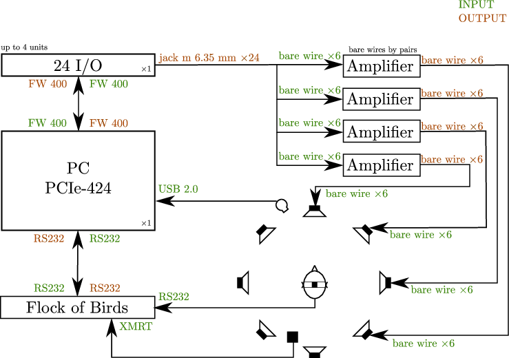
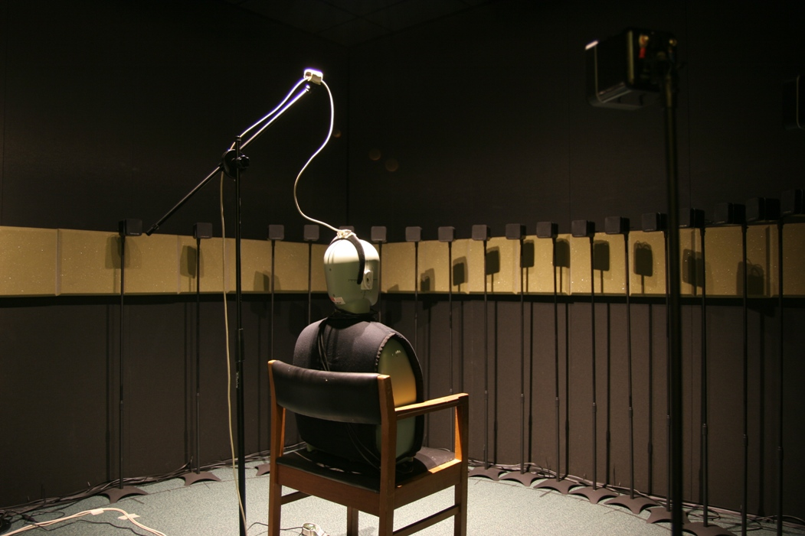
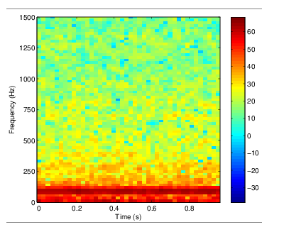
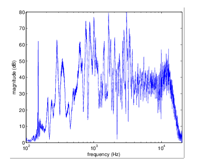

.. _ref-chap-lab:

Laboratory
##########

In order to measure the phenomena that we were interested in (see
chapter :ref:`ref-chap-filehne`). We created for the Perception group of the
School of Psychology of Cardiff University a new audiovisual lab. In audio
research, there is no standard measurement system but according to the needs we
will give a priority to two main techniques:

- :term:`VAS`
- :term:`RAS`

.. _ref-chap-lab-sec-vas-ras:

Virtual Auditory Space vs Real Auditory Space
=============================================

The :term:`VAS` is the ability to create the illusion of any free-field
environment using a closed-field sound system such as headphones or
loudspeakers. This technique assumes that identical stimuli will be perceived
identically at a listener's eardrum whatever the physical mode of delivery. It
is now accepted that the simulation of acoustical space is best achieved using
closed-field systems since headphones allow a complete control over the signal
delilvered to the listener's eardrums.  The disadvantage of this technique is
that it requires compensation of the transfer function of the sound delivery
system itself. Moreover, in order to give to the listener the perfect illusion
of a 3D audio scene, you will need to use the binaural technique. To achieve
that, it is necessary to recreate at each ear, the signals that would be
perceived naturally. The use of the :term:`HRTF` is the best way to reproduce
the localisation cues needed.
         
Binaural broadcasting technique
-------------------------------

The binaural synthesis is based on the use of the pair of binaural filters
obtained from the :term:`HRTF`. At each source position in the space :math:`r,
\theta, \phi` it exists a pair of :term:`HRTF`, that we can obtain through a
model or a set of measurements. In order to place a virtual source at a given
position, it is necessary to find the pair of :term:`HRIR` corresponding to the
position in a database if available or calculate the interpolation and deduce a
pair of binaural filters :math:`x_L` and :math:`x_R` adapted to the chosen
implementation.  For the headphone diffusion, the simplest way is to convolve
the monophonic and anechoic signal :math:`x` with each filter in order to
obtain the signals :math:`x_L` and :math:`x_R` that will be broadcast on the
headphones (see :numref:`fig-binaural-technique`). In addition, it is
necessary to compensate for the headphone that act as a filter.

.. _fig-binaural-technique:

   Binaural techique on headphones. After :cite:`Guillon2009`.

The spectral filtering of a sound source before it reaches the eardrum is
called the :term:`HRTF`. The binaural :term:`HRTF` can be thought of as a
frequency-dependent and amplitude and time-delay differences that result
primarily from the complex shaping of the pinnae. :cite:`Batteau1967` claimed
that the folds of the pinnae cause time delays within a range of $0$ to
:math:`300\mu`. This is a cause of a significant change in the spectral content
at the eardrum. Because of the asymetric shape of the pinnae, this spectral
changes vary with the source position.  Moreover, the shape of pinnae differ
from one subject to another. This means that in theory, we should measure the
:term:`HRIR` for an infinite number of positions in order to reconstruct
perfectly the signal at the eardrums. Because it is impossible to measure an
infinite number of points and because, measuring impulse responses of a subject
is still nowaday is difficult and long task suggesting a sampling of a finite
number position and then interpolate the missing positions. Another way is to
use a bank a average :term:`HRTF` and use the same bank for all subject. Both
techniques bring artefacts once convolved with the signals. Results are
localisation and externalisation of sounds problems. The externalisation
problem is not still perfectly known. Nevertheless, :cite:`Guillon2009`
suggested several possibilities that could have an impact on the
externalisation such as the fact that the listener knows that signal is
broadcast through the headphones, and feel the pressure of it on his ears. The
absence of visual cues, or incoherent signals between the visual and audio
modalities. The acoustics signals at the eardrums can be as well degrade due
the the distortion brought by the headphones.

Multi loudspeakers technique
^^^^^^^^^^^^^^^^^^^^^^^^^^^^

The use of loudspeakers instead of headphones avoid troubles about
externalisation of the sound and a difficult :term:`HRTF` measuring process.
Spatialisation of sound is more robust, all spatialisation cues are naturally
available and don't need to be recreated. Nevertheless, several problems still
exist such as the interpolation of sounds located between two speakers.

.. todo::
  Becareful, in both cases (VAS and RAS), the interpolation is not a real
  problem for the simple reason that in VAS, we can't measure an infinite 
  number of points, hence, we will interpolate several positions. In RAS, we
  will not have an infinite number of speakers, thus, we will interpolate any
  position that is located between two speakers.

Multi loudspeakers technique
^^^^^^^^^^^^^^^^^^^^^^^^^^^^

The use of loudspeakers instead of headphones avoid troubles about
externalisation of the sound and a difficult :term:`HRTF` measuring process.
Spatialisation of sound is more robust, all spatialisation cues are naturally
available and don't need to be recreated. Nevertheless, several problems still
exist such as the interpolation of sounds located between two speakers.

.. todo::
  Becareful, in both cases (VAS and RAS), the interpolation is not a real
  problem for the simple reason that in VAS, we can't measure an infinite 
  number of points, hence, we will interpolate several positions. In RAS, we
  will not have an infinite number of speakers, thus, we will interpolate any
  position that is located between two speakers.

Equipment
=========

Visual motion has been intensively investigated and need a quite standardised
equipment (see :cite:`Koenigs2010,Brenner2001,Freeman2001`). Audio motion
requires *ad hoc* systems and can differ a lot from one lab to another and will
depend mainly on using :term:`VAS` or :term:`RAS`
(:ref:`ref-chap-lab-sec-vas-ras`) and many other parameters. The lab's wiring
diagram is given on :numref:`ref-fig-lab-system` and a picture of the result is 
given on :numref:`ref-fig-lab-photo`.

.. _ref-fig-lab-system:

   Schematic of the lab audiovisual system. In green are represented 
   the inputs, in brown the outputs.

.. _ref-fig-lab-photo:

   Photo of the laboratory with a dummy head instead of a participant.

The room
--------

is a parallelipedic shape with a superficy of :math:`13.76m^2` (:math:`3.2 \times
4.3m`). The lab has several characteristics such as:

- black walls in order to minimize light reflections,
- a proof-sound material on the wall to minimize acoustics reflections,
- no isolation from the outside noise.

A plastic rail surrounding the room at the ears heigh (when a participant is
seated) has been covered with foam in order to reduce its impact on the
acoustic.  A measure of the :term:`RT` gave a result of :math:`60ms` on
average. A measure of the noise floor has been done and gave a result of
:math:`30` dB on average with a pic around :math:`60` dB at :math:`200` Hz
corresponding to the cooler system when it is turned on
(see :numref:`ref-fig-noise-floor`). Further investigation using acoustic antenna
technique (such as beamforming or holography) would help to find where is the
noise position and correct it in order to lower that noise. Because it is quite
low frequency, it should not be perceived as a ponctual source by the
participants and not interfere in the experiments.

.. _ref-fig-noise-floor:

  
   Noise floor of the laboratory with cooler system on.

Loudspeakers
------------

For the broadcasting of the signal, we needed multiple loudspeakers using a
:term:`RAS` (see :ref:`ref-chap-lab-sec-vas-ras`). Given the constraints we
decided to use broadband speakers with a small size in order to have a quite
high density. The system is composed of 24 *Minx min 10*, *Cambridge Audio*
loudspeakers (see :cite:`Cambridge2013`). These speakers are passive and
measure :math:`80 \times 80 \times 80mm`. The system uses :math:`22` fixed
speakers (with :math:`2` speakers that can be placed where it is needed) along
an hemicircle with a distance between each speaker of :math:`7.5^\circ`. As
shown on the :numref:`ref-fig-frequency-response-spk12`, the bandwith of the
speakers is on average about from :math:`200` Hz to :math:`10 000` Hz. This is
enough to use white noise in order to be able to use all acoustic available
cues.

.. _ref-fig-frequency-response-spk12:

   Frequency response of the speaker 12 (placed @ :math:`0^\circ`).

Amplifiers
----------

Because we decided to keep amplifiers in the room, we needed a passive cooling
system. We chose four :math:`6` channels *AMP-CH06, Auna* amplifiers: 

- Electric power: :math:`570` Watts RMS,
- frequency response: :math:`20` to :math:`20 000` Hz,
- :term:`SNR`: :math:`95` dB,
- impedance: :math:`16~\Omega`.

Head tracking
-------------

In order to measure head tracking, we have two systems that is used according
to the constraints of the experiment. A magnetic head tracker *Flock of Birds,
Ascension* (see :cite:`Ascension2004`) is used to record accurate head movements
position and rotation in 3 dimensions. This tracker let us to record
information in real time if it is needed to change the behavior of the
experiment according to the head movements. If the participant can't be aware
of his head tracking, a webcam *LifeCam HD 3000, Microsoft*
(see :cite:`Microsoft2011`) fixed above the participant's head on the ceiling
is used to record and movement and is analysed afterwards. This system is less
accurate and record only rotation in one dimension and position in 2
dimensions.

Video projector
---------------

In order to lead multi modalities experiments such as audiovisual experiments, 
a video project has been installed. Because of the room characteristics, a
small and quiet projector were needed. A *Qumi Q2, Vivitek* (see
:cite:`Vivitek2013`) has been chosen and will be fixed on the ceiling above the
participant's head.

Sound card
----------

for flexibility we used a *24~I/O, Motu* :term:`DAC` and a *PCIexpress, Motu*
sound card (see :cite:`Motu2013`). The sound card can handle up to :math:`4`
:term:`DAC` (:math:`96` channels) at :math:`24` bits quantification and
:math:`96` kHz.

IT equipment
------------

The computer is in a operating room next to the lab in order to minimise the
acoustic impact. The main components of the computer are a *i5-2400, Intel*
processor with :math:`3` GB of :term:`RAM`.

Softwares
---------

Any software capable of using :term:`ASIO` driver can be used to handle the
high number of channels if there is no need of head tracking. Nevertheless, for
the processing and for the experiments described in this document, *Pure Data*
has been used to lead the experiments, *Matlab, Mathworks* or *GNU Octave* with
the toolbox *Playrec* has been used for measurements or data analysis.  The
main advantage of using *Pure Data* is the real time processing and its
capacities to handle the head tracker *Flock of Birds, Ascension*.

Loudspeaker compensation
------------------------

As shown on :numref:`ref-fig-frequency-response-spk12`, the response of the 
speaker is chaotic and because of its mechanic assembly, the frequency response
will differ from one to the other. These differences can be heard by the
participants and give them intrusive spectral or intensity cues that could bias
the experiments. Because of the spectral response of the speakers, rather than
trying to flatter it, it has been decided to bring the same default to every
speakers. The speaker at :math:`0^\circ` in front of the listener is the
reference.  The principle is to extract for each speaker impulse response the
corresponding excitation pattern [#f1]_ (see equation
:eq:`excitation-pattern`), get the spectrum difference from the reference
excitation according to the current one and convolve the current impulse
response with the spectrum difference.

.. math::
  :label: excitation-pattern

  W(g) = (1 + pg) \exp (-pg)

Where :math:`p` determines the shape of the pass band filter. :math:`g` is the
deviation in frequency from the filter center frequency divided by the center
frequency.

.. rubric:: Footnotes

.. [#f1]  The excitation pattern is the distribution of internal excitation as
          a function of some internal variable related to frequency.
